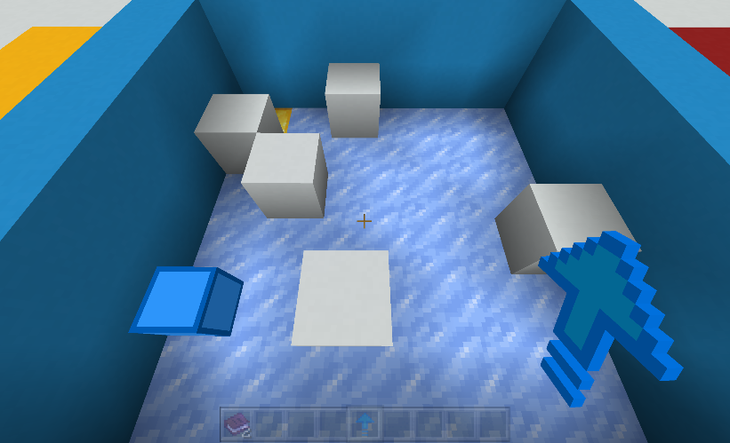
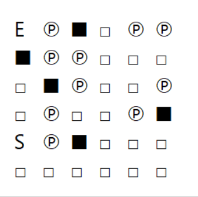
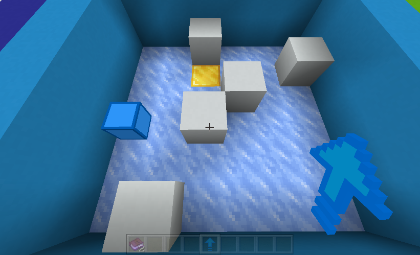
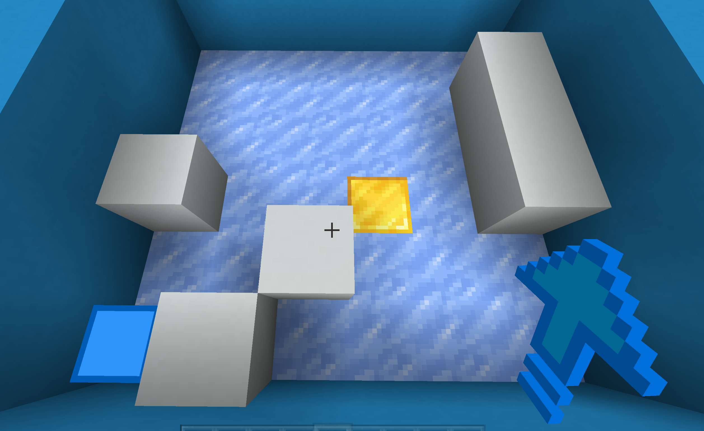

## Introduce 
1. Input your map in your game



2. run the script

Then get the answer hint



the mean is that following the hint, you can get the answer


# How to use
1. Input your map in your game
border is 1, and the floor is 0, 6 is entrance and 9 is exit like this:

```python
[[0, 0, 0, 0, 0, 0],
[0, 1, 0, 0, 0, 1],
[0, 0, 0, 0, 0, 0],
[0, 0, 0, 0, 0, 0],
[1, 0, 0, 0, 0, 0],
[0, 0, 0, 1, 0, 1]]
```

℗	℗	□	□	□	□	
□	□	□	□	□	■	
℗	□	□	□	℗	■	
■	□	□	E	□	■	
℗	℗	■	℗	□	℗	
S	■	□	■	℗	℗	


## The more instances


```python
map_lv11 = [
[0, 0, 1, 0, 0, 0],
[0, 0, 0, 0, 0, 1],
[0, 0, 0, 1, 0, 0],
[0, 0, 1, 0, 0, 0],
[0, 0, 0, 0, 0, 0],
[0, 1, 0, 0, 0, 0]]
```


```python
map_lv12 = [
[0, 0, 0, 0, 0, 0],
[0, 0, 0, 0, 0, 1],
[0, 0, 0, 0, 0, 1],
[1, 0, 0, 9, 0, 1],
[0, 0, 1, 0, 0, 0],
[6, 1, 0, 1, 0, 0]]
```