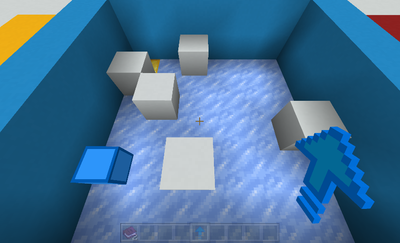
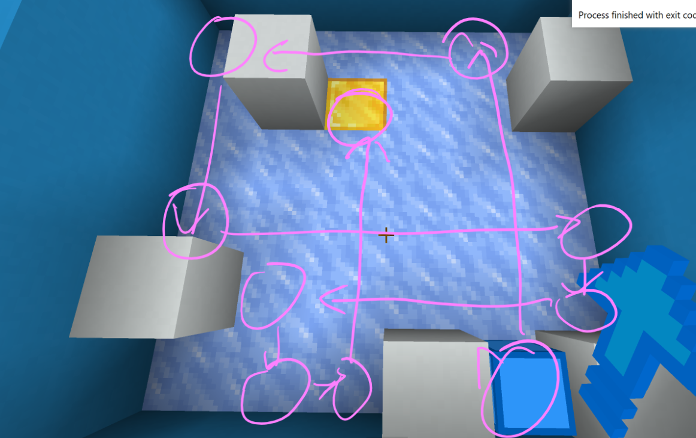
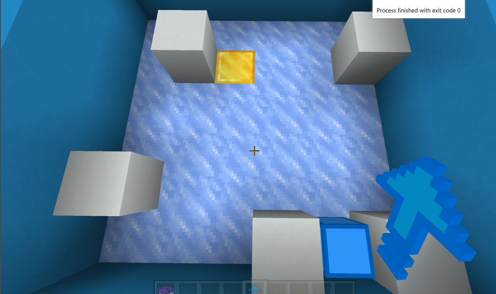
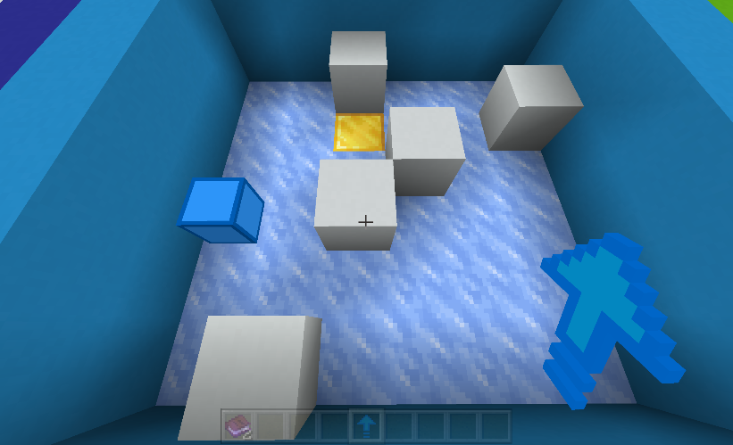
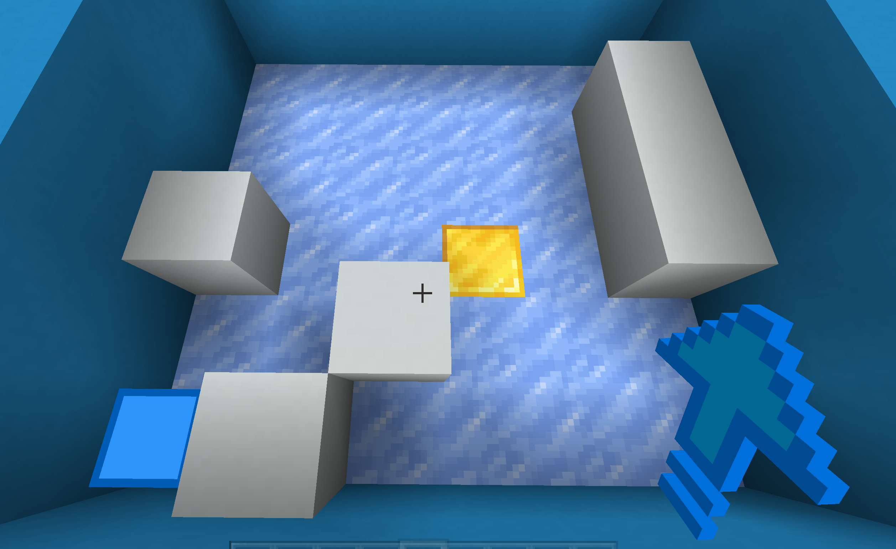

## Introduce 
A cracker in the sub0, a mini-game of Minecraft official Map, use that can get the answer of the level map.

## Usage
### 1. Input the map in your game



### 2. run the script

Then get the answer hint
```
that is also as following graph shown:
	0	1	2	3	4	5	6	7
0 	　	　	　	■	　	　	　	　	
1 	　	　	　	■	　	　	　	　	
2 	　	　	　	　	　	　	S	①	
3 	　	■	　	■	　	　	　	↓	
4 	■	⑧	→	→	→	⑨	■	↓	
5 	　	↑	　	■	　	⑩	E	↓	
6 	⑤	↑	←	④	　	■	　	↓	
7 	⑥	⑦	■	③	←	←	←	②	
```

Which mean is that following the hint, you can get the answer



# How to use
1. Input your map in your game, the format is like this:
border is 1 and the floor is 0,
2. 6 is entrance and 9 is exit like this:

```python
lv10 = [[0, 0, 0, 0, 0, 0],
[0, 1, 0, 0, 0, 1],
[0, 0, 0, 0, 0, 0],
[0, 0, 0, 0, 0, 0],
[1, 0, 0, 0, 0, 0],
[0, 0, 0, 1, 0, 1]]
```

## The more instances


```python
map_lv11 = [
[0, 0, 1, 0, 0, 0],
[0, 0, 0, 0, 0, 1],
[0, 0, 0, 1, 0, 0],
[0, 0, 1, 0, 0, 0],
[0, 0, 0, 0, 0, 0],
[0, 1, 0, 0, 0, 0]]
```


```python
map_lv12 = [
[0, 0, 0, 0, 0, 0],
[0, 0, 0, 0, 0, 1],
[0, 0, 0, 0, 0, 1],
[1, 0, 0, 9, 0, 1],
[0, 0, 1, 0, 0, 0],
[6, 1, 0, 1, 0, 0]]
```
