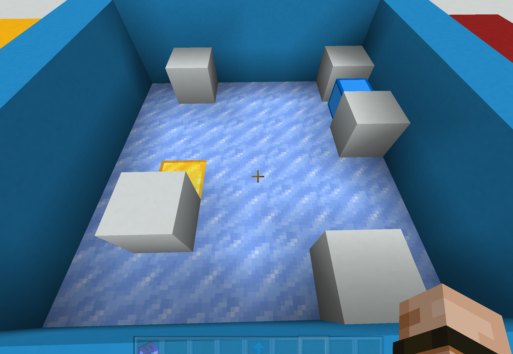

## Introduce 
<hr>
A cracker in the sub0, a mini-game of Minecraft official Map, use that can get the answer to pass the level map.

## How to use
<hr>

### 1. Input the map which is at your level in the game
The map of the level you arrived.
<div align="center">
    
    <p style="font-size: 18px">For Instance, level 10</p>
</div>

```python
# border is 1 and the floor is 0
# 6 is entrance and 9 is exit 
# like this:
map_lv10 = [ # turn it to digital map with a list 
            [0, 1, 0, 0, 0, 1],
            [0, 0, 0, 0, 0, 6],
            [0, 0, 0, 0, 0, 1],
            [0, 9, 0, 0, 0, 0],
            [0, 1, 0, 0, 0, 0],
            [0, 0, 0, 0, 1, 1]
    ]
```

### 2. run the script
Then you will get the answer hint

```
MAP:  10
Stt:  [1, 5] 
End:  [3, 1]
path:  [[1, 5], [1, 0], [5, 0], [5, 3], [0, 3], [0, 4], [4, 4], [4, 5], [3, 5], [3, 1]]
step:  10
that is also as following graph shown:

	0	1	2	3	4	5
0 	　	■	　	④	⑤	■	
1 	①	←	←	↑	↓	S	
2 	↓	　	　	↑	↓	■	
3 	↓	E	←	←	←	⑧	
4 	↓	■	　	↑	⑥	⑦	
5 	②	→	→	③	■	■	
```

Which mean is that following the hint, you can pass the level easily.


## One More Thing
<hr>
If you want to know more about the game, you can visit the official website of EverBloom Studio: 

[https://everbloomgames.com/minecraft-maps/sub0/](https://everbloomgames.com/minecraft-maps/sub0/)
## official Introduce about the game
Slide a blue cube across the ice to the gold block. Sounds easy, right? Challenge yourself and complete all 40 brain-bending levels! This frozen puzzle map is fun for all ages!